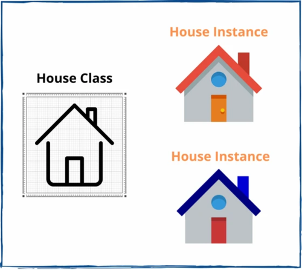
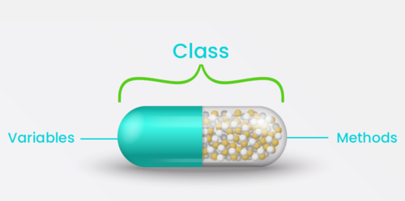
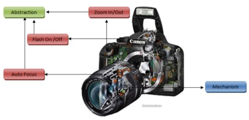

# Single responsibility principle

## Theory
A class should only have a single responsibility, that is, only 
changes to one part of the software's specification 
should be able to affect the specification of the class.
That might sound very theoretic so look at the old.ts file and 
open the index.html file, 
you can see the software has some options to handle fuel, music 
and the engine. There are a couple of problems with this:

- The Car class is a classic example of a so-called “God object” — that is, an object that 
knows about and does everything. These types of objects are really hard to maintain, extend and test.
- We have to prefix every variable with the correct domain eg. "engineStatus". 
It would be nicer to just name it "Status" but we cannot do this in the car because you might 
confuse it with the status of the MusicPlayer.
- What if want different types of engines with different ways of consuming fuel? We would have to put a 
lot of extra if-statements in our car class.

## Your mission
Look at the old.ts file and open the index.html file, you can see the software has some options 
to handle fuel, music and the engine. However, these are really 3 separate domains making the 
current Car object really strange.
Refactor the code, so we have at least a separate class for Car, Engine and MusicPlayer. 
Where do you think we should place the fuel functionality?

### Extra challenge
Make a new type of Engine that also consumes Fuel

### MY PREPARATION
- Make sure I understand what a class is:

  * A class is actually nothing but air.  It's a plan in which we describe what we are going to make and what it is 
  going to be able to do.
  
  * inside that class we can add:
    - properties: describing attributes
    - constructor: place to set-up initial values.  Now each instantiated object will automatically get these.
    - methods: actions that need to be performed.  Much like a function.
    - getters: protects the data and returns the value of that specific getter.
    - setters: update or set the value of that specific setter.
  But where and how do we turn this plan into something we can actually see and touch you ask..
  For that we need to create an instance of the class which will contain all the data and behaviour, we described inside the class.  
  All we really need for that is the keyword: "new".
   Et voila, now we have an object called: car.
   
- Make sure I understand the 4 pillars of OOP: 

  * ENCAPSULATION: making sure every property and/or separate method for a class or object is enclosed 
  like in a capsule, thereby keeping those as private as possible.
  
  * ABSTRACTION: Hiding the encapsulated content inside a method.  You don't need to actually know all the detailed 
  little steps... In the end it just needs to work. 
  
  * INHERITANCE: Classes & objects can inherit properties and behaviours from another class = parent class.  Which 
  means, the code is simply reused.  The child can have its own extra properties & methods.  Important to know: the child 
  * can not remove things from the parent!  
  
  * POLYMORPHISM: Basicly, if inheritance is used correctly, each child of the parent should be able to use the same methods 
  

- Read and try to understand the provided links regarding this exercise SRP (Single Responsibility Principle) + 
refactoring guru.

### THE ACTUAL EXERCISE
I started over 3 times.  After all the main goal here is understanding.
We started with a quite messy code that did what it was supposed to do but there was no sign of the single 
responibility principle.  Everything was just put inside the car-class.  

## MUSICPLAYER
1. To change that.  I start by taking out everything related to the music player and give it its own class.  
Because this has its own specific goal, which is to turn it on/off.  It will make things easier for the future when 
we want to change the music player. Right? we don't need to change the whole car for that!
2. Then back to the carr-class.  We do want a music-player inside the car.  For that I add a musicPlayer property 
and instantiate it as a new musicPlayer-object inside the car-constructor.
3. Next I make a getter to make sure I can do all the things I want to do with my musicPlayer from inside the car.
4. All there's left to do is make minor changes inside the functions which relay to the musicplayer.  car.musicLevel 
for example, will no longer work, since the car doesn't know anything about the musicLevel anymore.  
But, when we tell to go inside the car, look for the music-player, and then inside the music-player to look for the 
musicLevel, it works!  Just like that: car.musicPlayer.musicLevel.

## ENGINE
I have to admit I do not now a lot about cars.  I do now how to drive, and I prefer not to do that in a "Flinstones" 
way, So an engine it is.  And an engine needs fuel.  Oh God... this is where I need to crack my brains a bit more.
because the fuel goes directly in the car, that's where ist's stored and... where o where shall I place 
the fuel?  A car without an engine but with fuel, can't drive.  A car without fuel but with engine, can't drive.  
Let's make a class for the engine, and a separate one for the fuel-tank then.

6. I make a class for the engine.  I can now change "engineStatus" in just "status" because the musicPlayer in no 
longer in the way.  This will tell us if the engine is or is not running.  We also need to know the distance the engine 
can work depending on the amount of fuel = FUEL_MILEAGE.  For that we need to now the miles and get access to fuel 
inside the tank-class which will be made after this one. Leaving the fuel and the tank for what they are.  I continue
moving everything related to the status, fuel_mileage and miles from the carr-class, into the engine_class.
7. Just like the musicPlayer, an engine is needed inside the car.  An engine-property is added and then instantiated 
as a new object inside the car-constructor.
8. Same-o-same-o, a getter for the engine makes sure I can make the engine work inside the car.
9. And then again those minor changes to lead the correct way for the functions to do their thingy.

## TANK
10. The engine won't work yet. It needs fuel.  Time to give a maximal-capacity to the tank and make sure it's for 
fuel. And the weight of the car-class goes down again, as I move all tank related properties and methods out, into the
tank-class.
11. As I said earlier, it's not realy the car that needs the fuel, but the engine.  That's why I will now add a 
tank-property to the engine-class and instatiate that one inside the constructor.
12. A getter inside the engine will make sure we can get all data & actions from within the engine.  Since the 
engine is already in the car, the car can also gets this done.  Niiiiiiice.
13. The last changes inside the functions.. and that's that.

## CAR
14. The drive() method gives me an error.  Clearly it's because I'm trying to keep things private.  As I should.
The adaptation of the fuel as wel as the miles, are methods that should live inside the appropriate classes.
As I say, I do and now I can easily call those methods inside the drive()-method.

## CLEAN-UP
16. I don't want any global variables if not necessary, so I look for functions that need a certain variable only
once, and and paste it inside the functions.
17. Also, I can now make some constants to remove the repeated text.

