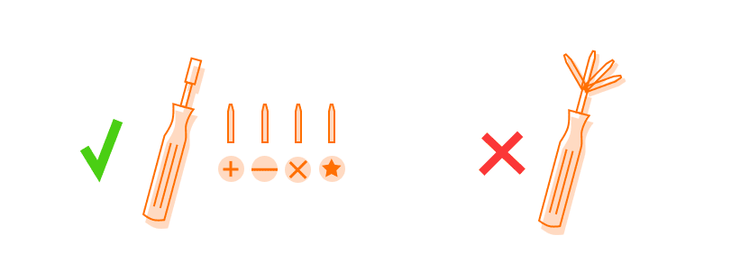

# Open–closed principle
Classes should be open for extension, but closed for modification. In more simple words you can always add new code to
an object, but you should never change the design of old code.

It is much better to work with **dependencies**, meaning passing an object to another object as a parameter. 

Ideal code should be written with the **Blackbox** principle in mind, you should be able to guess what a function does 
just looking at its signature.

Consider how the coupling of two entities affects their respective maintainability. The more a given entity knows about 
how another one is implemented, the more we can say that they are coupled. Therefore, if one of the two entities is 
changed, then the other must be changed too.

### Arrays with meaning
Other examples of bad code practices not listing to the Open Closed Principle is having objects return Associative 
Arrays with meaning (the labels are used later on outside the class)

````typescript
function getProducts() {
    return [{'name': 'chair', 'price': 5}, {'name': 'table', 'price': 15}, {'name': 'bed', 'price': 20}];
}
//the zero at the end refers to the default value when no total has been calculated yet (first value of total)
// This is needed in case the getProducts() returns an empty array
let totalPrice = getProducts().reduce((total, product) => total + product.price, 0);
````

You can improve on this in 2 ways in TypeScript, you can create a Product class or create a literal:
````typescript
    type Product = {'name': string, 'price': number};
    type ProductCollection = Product[];
````

## Your mission
Look at the old.ts file, and you see a bunch of animals in a zoo, all making the sounds.
Now add another animal (you can choose your favorite animal), and make sure it makes a sound.

Did you notice you needed to alter the Zoo object even when all you did was add a new Animal class? Would it not be 
much better to move the `makeSound` function to each Animal class, so each animal can decide for himself what sound he 
makes instead of the Zoo class?

Create a `makeSound` function to each Animal class and remove the giant switch from the Zoo class. Now you can easily 
add new animals without altering an existing class!

## MY PREPARATION
- Read and try to understand the provided links regarding this exercise OCP (Open-closed Principle).
* CODE SHOULD BE OPEN FOR EXTENSION, BUT CLOSED FOR MODIFICATION!


## THE ACTUAL EXERCISE
- The first thing I notice is that each individual animal inside the zoo has its own name with a getter & setter for it.  
- Each also has a getter for the type of animal but no sign of where to get the type from.  Nothing more, nothing less.
- The zoo has then a method which will give each animal a sound.  So wait... The animal is born as a specific kind, it 
gets a name, BUT then, later the zoo decides which sound it is going to make?  That makes no sense.  
- That's not just it..., if and when a new animal joins the zoo, a new class needs to be made and changes are needed 
inside the zoo in order for the animal to make sound. Complicated it is..  Complicated it should not be!  
- Time for the animal to decide at least some things for itself.

## MY ACTIONS
1. Add the type as a property and give it a type: string (same for the name).
2. Add name & type inside the constructor and pass the value of the type.
3. Extract the behavior for the makeSound() method out of the Zoo-class.
4. Make an interface "Sound" in which a makeSound()-method gets passed.  What is an interface? An interface defines the 
specifications of an entity. It lays out the contract that states what needs to be done but doesn’t specify how it 
will be done.
5. Each animal-class implements "Sound"
6. Each animal-class gets the makeSound()method & here the actual sound gets to be defined.
7. Add a monkey, give it it's own class and touch nothing else.  See if it works.... It works -HappyHappyJoyJoy-


