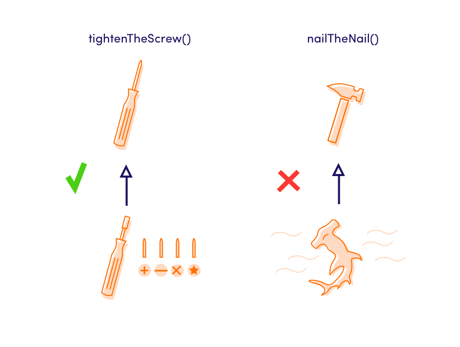

# Liskov substitution principle
"Objects in a program should be replaceable with instances of their subtypes without altering the correctness of that 
program." See also [design by contract](https://en.wikipedia.org/wiki/Design_by_contract).

### Polymorphism
You might already be aware of Polymorphism, but just to remind you, here is the short summary:
If 2 different classes use **the same interface**, so they have the same function names: the code that uses this class 
does not care about which one class it receives. In short: When two objects have the same interface, they are 
functionally interchangeable = polymorphism.

## Your mission
Look at the old.ts file and open the index.html file, refactor the Discount class in 3 different classes with the same 
interface "VariableDiscount" & "FixedDiscount" & "NoDiscount"

### Discuss
Do you understand what the use is of having the class NoDiscount? This prevents us from having to write extra 
if-statements inside product to check if we actually have a Discount dependency. It might look strange but these null 
or void classes are very common in a lot of popular libraries!

## MY PREPARATION
- Read and try to understand the provided links regarding this exercise LSP (Liskov substitution Principle).
* YOU CAN USE ANY INHERITING CLASS IN PLACE OF THE BASE CLASS. If we implement a subclass, we must also be able to use 
it instead of the main class. Otherwise, it means that inheritance has been implemented incorrectly.

## THE ACTUAL EXERCISE:
1. I have 3 classes: Discount, Product, ShoppingBasket.  
   * Discount needs to be refactored in 3 different classes: "VariableDiscount" & "FixedDiscount" & "NoDiscount". So I
   guess I'll start off, creating those.  They will each extend from the Discount-class.
2. Now, I need an interface, which will be used by these newly born classes.  I'll call it "DiscountMethods".
3. Inside the Discount-class we no longer need the type.  So this one we can class vertically (remove).
4. And then I start moving, without any further, the things that apply to the extended discount-classes.
5. Now it is time to check what exactly I moved and clean it out.  The if's and else-if's can go, "adios aligos".  
The same with the throw error's.  Feels good!
6. I was thought that if you break something that doesn't belong to you.  You fix it, or you replace it.  Time to
build it back up, then.  Thinking out loud: "All children wil automatically inherit the _value from its parent".
At the moment my Typescript is complaining, it doesn't know value.  Meaning Its time to give them a constructor.
What is super()?  That's new.  Google, here I come...  "The super call must supply all the parameters from the 
parent-class.  The super keyword can be used in two ways: as a "function call" (super(...args)), or as a
"property lookup" (super.prop and super[expr])." And the complaining is over.
7. The apply and showCalculation methods are still unknown.  That's where the interface I created comes in.
8. What's done is done.  The young classes are ready to be used.
9. At this point, there's just a few complains left: 
   - the product-class doesn't know the apply() and showCalcultion():  The property discount is now no longer a genaral 
   discount.  It is also not possible to sum up the different kinds of discounts.  What I can do is use the interface: 
   DiscountMethods which is used in all of them.
   - tableElement is possibly null:  A cast is needed here.  Calling it a tableElement is not enough here.  Because, who
   can be sure this is effectively a table-element?  Adding: <HTMLTableElement>, makes the complaint disappear.
     * Type casting allows you to convert a variable from one type to another.
     * Use the as keyword or <> operator for type castings.
   Now that I'm error-free... time to move on to the Interface Segregation Principle.